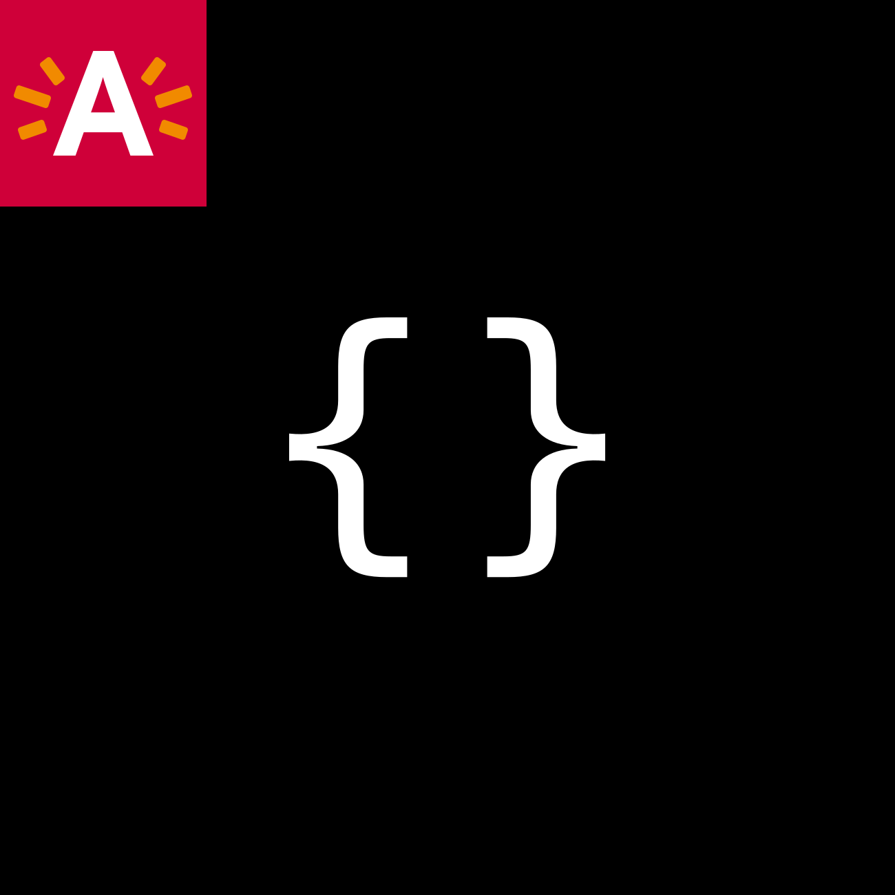

[](https://coveralls.io/github/digipolisantwerp/log_module_nodejs?branch=main)
[](https://badge.fury.io/js/%40digipolis%2Frequest-log)

**npm:** [npmjs.com/package/@digipolis/request-log](https://www.npmjs.com/package/@digipolis/request-log)
# @digipolis/request-log


Request Log helper to log incoming / outgoing calls.


### Table of contents:

<!--ts-->
   * [Installing](#installing)
      * [npm](#npm)
      * [Yarn](#yarn)
   * [Configuration](#configuration)
   * [Logging](#logging)
   * [Running the tests](#running-the-tests)
   * [Versioning](#versioning)
   * [Authors](#authors)
   * [License](#license)
<!--te-->

## Spec
[https://github.com/digipolisantwerpdocumentation/logging-requirements](https://github.com/digipolisantwerpdocumentation/logging-requirements)
## Installing

#### npm:
```sh
$ npm i @digipolis/request-log
```

#### Yarn:
```sh
$ yarn add @digipolis/request-log
```

## Configuration

##### Params:
| Param                                      | Description          | Values                                                                                                  |
| :---                                       | :---                 | :---                                                                                                    |
| ***type*** *(optional)*                    | Set logging mode     | **log** (default) / **json** / **text**                                                                 |
| ***logResponsePayload*** *(optional)*      | log response payload | **true** / **false** (default)                                                                          |
| ***logResponseHeaders*** *(optional)*      | log response headers | **true** (all headers) / `["headername1", "headername2"]` (log headers in array) / **false** (default)  |
| ***logRequestPayload*** *(optional)*       | log request headers  | **true** (default) / **false** (return)                                                                 |
| ***logRequestHeaders*** *(optional)*       | log request payload  | **true** (all headers) / `["headername1", "headername2"]`  (log headers in array) / **false** (default) |


##### Example:
```javascript
const { requestlogger, requestMiddleware } = require('@digipolis/request-log');


const config = {
  logResponsePayload: true,
  logRequestHeaders: ['dgp-correlation'],
  logRequestPayload: true,
  logResponseHeaders: ['x-powered-by'],
};

// log external requests
requestlogger(config);

function initializeExpress() {
   const app = express();
   // log incoming requests
   app.use(requestMiddleware(config);
}

```
